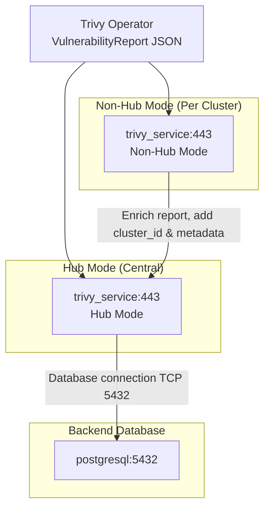

```mermaid
flowchart TD
  TrivyOperator["Trivy Operator<br/>VulnerabilityReport JSON"]

  subgraph NonHubMode["Non-Hub Mode (Per Cluster)"]
      NHService["trivy_service:443<br/>Non-Hub Mode<br"]
  end

  subgraph HubMode["Hub Mode (Central)"]
      HubService["trivy_service:443<br/>Hub Mode<br"]
  end

  subgraph DB["Backend Database"]
      BackendDB["postgresql:5432"]
  end

  %% VulnerabilityReport goes to both Hub and Non-Hub
  TrivyOperator --> NHService
  TrivyOperator --> HubService

  %% Non-Hub forwards enriched report to Hub
  NHService -->|"Enrich report, add cluster_id & metadata"| HubService

  %% Hub sends data to DB
  HubService -->|"Database connection TCP 5432"| BackendDB
```
